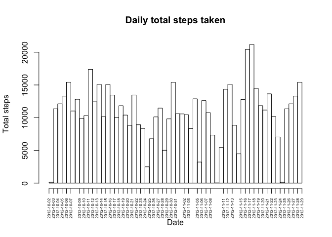
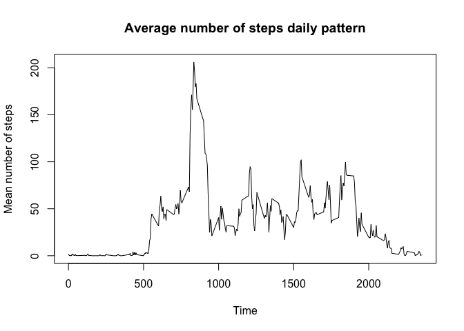
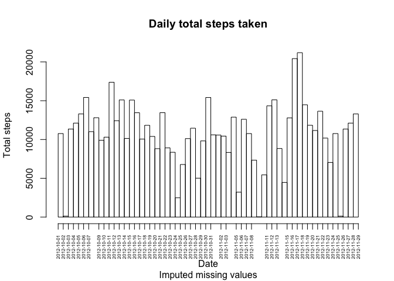
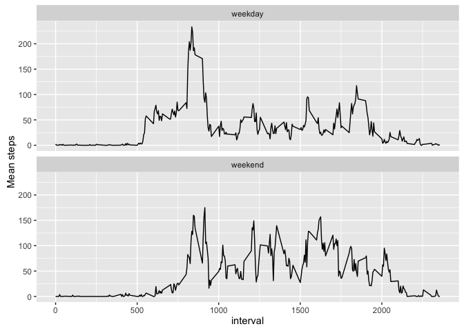

# Reproducible Research: Peer Assessment 1

## Loading and preprocessing the data

```r
actdata = read.csv("activity.csv")
actdata$date = as.Date(actdata$date)
```

## Histogram of total number of steps taken each day

```r
summaryactdata = aggregate(steps ~ date, data=actdata, FUN=sum, na.rm=TRUE)
colnames(summaryactdata)[2] = "totalsteps"

h = hist(summaryactdata$date, breaks="days", plot=FALSE)
h$counts = summaryactdata$totalsteps
plot(h, xaxt="n", main="Daily total steps taken", ylab="Total steps", xlab="Date")
axis(1, at=summaryactdata$date, labels=as.character(summaryactdata$date), las=2, cex.axis=0.5)
```

<!-- -->

## What is mean total number of steps taken per day?

```r
options(scipen = 6)
meantotalsteps = mean(summaryactdata$totalsteps, na.rm=TRUE)
mediantotalsteps = median(summaryactdata$totalsteps, na.rm=TRUE)
```
Mean total steps taken per day = 10766.1886792

Median total steps taken per day = 10765


## What is the average daily activity pattern?

```r
avgdailypattern = aggregate(steps ~ interval, data=actdata, FUN=mean, na.rm=TRUE)
plot(avgdailypattern, type="l", main="Average number of steps daily pattern", xlab="Time", ylab="Mean number of steps")
```

<!-- -->

```r
maxavgsteps = max(avgdailypattern$steps)
maxavgstepsinterval = avgdailypattern[which(avgdailypattern$steps == maxavgsteps),]$interval
```

Interval with maximum average number of steps = 835


## Imputing missing values

```r
totalmissingvalues = sum(is.na(actdata$steps))
```
Total number of missing values in dataset = 2304

Create a new dataset by filling in the missing values from the mean number of steps at corresponding interval.

```r
newactdata = actdata
newactdata$steps = ifelse(is.na(newactdata$steps), 
                          avgdailypattern[which(newactdata$interval == avgdailypattern$interval),]$steps, newactdata$steps)
```

New histogram of total number of steps daily

```r
newsummaryactdata = aggregate(steps ~ date, data=newactdata, FUN=sum)
colnames(newsummaryactdata)[2] = "totalsteps"

h = hist(newsummaryactdata$date, breaks="days", plot=FALSE)
h$counts = newsummaryactdata$totalsteps
plot(h, xaxt="n", main="Daily total steps taken", sub="Imputed missing values", ylab="Total steps", xlab="Date")
axis(1, at=newsummaryactdata$date, labels=as.character(newsummaryactdata$date), las=2, cex.axis=0.5)
```

<!-- -->

Compute the new daily mean and median

```r
newmeantotalsteps = mean(newsummaryactdata$totalsteps, na.rm=TRUE)
newmediantotalsteps = median(newsummaryactdata$totalsteps, na.rm=TRUE)
```
New mean total steps taken per day = 10766.1886792

New median total steps taken per day = 10765.5943396

The imputed data does not change the mean total steps taken per day but it changes the median total steps taken per day.

Imputing data only affects the days where there are missing data.

## Are there differences in activity patterns between weekdays and weekends?
Add new column factor variable for weekday/weekend

```r
newactdata$daytype = as.factor(ifelse(weekdays(newactdata$date) %in% c("Saturday", "Sunday"), "weekend", "weekday"))
```

Compute the average daily weekend and weekday pattern

```r
avgdailypattern = aggregate(steps ~ interval + daytype, data=newactdata, FUN=mean)
```

Plot the average daily pattern for weekend and weekdays

```r
library(ggplot2)

ggplot(avgdailypattern, aes(x=interval, y=steps)) + 
  ylab("Mean steps") + geom_line() +
  facet_wrap(~daytype, ncol=1)
```

<!-- -->

